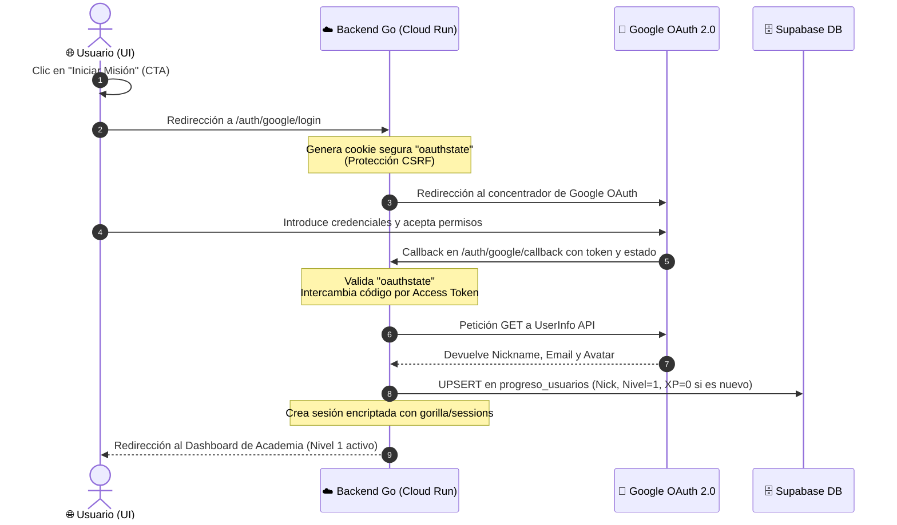

# Módulo 1: Presentación - Landing Page Isométrica

## 📌 1. Introducción y Concepto
La puerta de entrada a **GOland** no es un formulario de registro convencional. Es una experiencia inmersiva e interactiva diseñada como una **Landing Page Isométrica** que simula un universo flotante de conocimiento Go.

El usuario es recibido en esta isla virtual por **"The Professor"**, el agente de IA guía (impulsado por Gemini 1.5), quien introduce la narrativa de la plataforma, evalúa el estado del usuario y lo conduce de forma cinemática hacia el ecosistema de aprendizaje.

```
┌────────────────────────────────────────────────────────────────────────┐
│                          FLUJO PRINCIPAL DE M1                         │
│  Visita Landing ➔ Recibimiento de IA ➔ Parallax Activo ➔ Google Login  │
└────────────────────────────────────────────────────────────────────────┘
```

---

## 🎨 2. La Landing Page Isométrica
La interfaz gira en torno a un lienzo visual centrado en la ilustración de la isla de GOland (`GOland.png`). Este elemento visual no es estático; responde a los movimientos del ratón del usuario y a animaciones continuas controladas.

### Elementos Visuales Clave
1.  **Isla Flotante de Cristal:** La roca central donde residen las academias de Go y los laboratorios de programación.
2.  **Agentes GOnions Flotantes:** Pequeños avatares representados en sprites isométricos que orbitan la isla.
3.  **Terminal de Diagnóstico de Inicio:** Un panel translúcido de vidrio (Glassmorphism) en la parte izquierda que muestra un flujo de mensajes simulados de un cargador del sistema.
4.  **Botonera Flotante Ciber-Zen:** El CTA principal de "Iniciar Misión" (Login con Google OAuth).

---

## 🧠 3. El Agente "The Professor" (Gemini 1.5)
En este módulo, **The Professor** actúa como anfitrión y orquestador del onboarding. Su objetivo es sumergir al usuario en el juego técnico sin causar fricción.

### Flujo de Interacción de Onboarding
*   **Trigger de Entrada:** Nada más cargar la landing page, el panel flotante de conversación se inicializa en estado "Minimizado" y realiza un rebote de llamada de atención (Hover Kawaii).
*   **Mensaje de Bienvenida:** Al maximizarse, The Professor inicia una secuencia de escritura en terminal (Typewriter) saludando al visitante:
    ```
    [SYSTEM]: Conectando con Orquestador Swarm...
    [PROFESSOR]: ¡Saludos, programador! Bienvenido a bordo de la estación de aprendizaje GOland. 
    Soy el Profesor y guiaré tus primeros pasos en esta nave. Para iniciar tu viaje en los
    sistemas concurrentes, primero debemos sincronizar tu perfil de tripulación.
    ```
*   **Evaluación del Estado:** The Professor interfiere en la UI incitando al usuario a hacer clic en el botón de acceso para sincronizar su progreso o detectar si es un tripulante retornado.

---

## 🔒 4. Flujo de Autenticación con Google OAuth 2.0
El botón de "Iniciar Misión" dispara el flujo seguro de autenticación de Google integrado con el backend de Go 1.26.3 y persistido en la nube en Supabase:



---

## 🎬 5. La Transición Cinemática estilo Claude Code
Cuando el usuario pulsa en "Iniciar Misión", la transición a la pantalla de la Academia e IDE se realiza mediante una fluida animación coordinada por CSS y JS:

1.  **Fase 1 - Zoom Tridimensional:** La isla isométrica de fondo (`GOland.png`) hace un efecto de zoom escalándose sutilmente (`transform: scale(1.15)`) y aplicando un filtro de desenfoque (`filter: blur(15px) brightness(0.4)`) en una transición suave de 0.8s.
2.  **Fase 2 - Desvanecimiento del Entorno:** La cabecera y el fondo de la landing se desvanecen gradualmente (`opacity: 0`).
3.  **Fase 3 - Entrada de la Consola Holográfica:** El panel de terminal de cristal se desliza verticalmente desde la base de la pantalla hacia el centro (`transform: translateY(0)`), estableciendo la conexión persistente con el WebSocket `/ws/swarm`.
4.  **Fase 4 - Activación del Cursor Ciber-Zen:** Se activa el editor de código interactivo, enfocando el cursor de bloque parpadeante (█) en el primer reto de aprendizaje generado para el usuario por The Professor.

---

## 🛠️ 6. Especificación de Rutas HTTP de Presentación
*   `GET /`: Sirve los archivos estáticos de la landing page (`ui/index.html`, `ui/style.css`, `ui/app.js`).
*   `GET /auth/google/login`: Handler que inicia el flujo de autenticación de Google y redirige a la pantalla de consentimiento de Google.
*   `GET /auth/google/callback`: Recibe el callback de Google, valida el token, crea la sesión inyectando `user_nick` en la cookie firmada y redirige al panel interactivo de la Academia.
*   `GET /auth/status`: Endpoint consumido asíncronamente por el frontend para validar si el usuario ya cuenta con una sesión válida activa, evitando el re-logueo.
