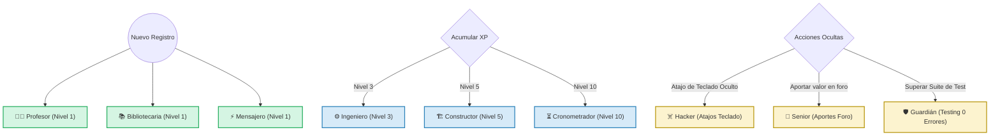

# Módulo 2: GOmions - Sistema RPG de Agentes de IA

## 📌 1. Concepto y Definición de GOmion
Los **GOmions** (o GOmions) son asistentes cognitivos interactivos basados en la API de **Gemini 1.5 (Pro/Flash)**. Cada GOmion posee un rol específico de ingeniería de software, un set de habilidades técnicas diferenciadas y una personalidad e identidad narrativa únicas.

En lugar de ser un bot de chat plano, cada GOmion se comporta como un personaje RPG de soporte. Su nivel de complejidad conceptual en las respuestas, su vocabulario y los sprites visuales que lo representan evolucionan progresivamente de acuerdo con el progreso y nivel acumulado del usuario en la plataforma.

```
┌────────────────────────────────────────────────────────────────────────┐
│                          FLUJO INTERACTIVO                             │
│  WebSocket ➔ Prompt Específico ➔ Evaluación de Código ➔ Animación      │
└────────────────────────────────────────────────────────────────────────┘
```

---

## 👥 2. El Ecosistema de GOmions (9 Perfiles)

El núcleo operativo de GOland cuenta con **9 perfiles de agentes** con tareas y voces de sistema diferenciadas:

| # | Agente | Rol Técnico | Personalidad y Tono | Activador / Habilidad Clave |
| :-: | :--- | :--- | :--- | :--- |
| 1 | **Profesor** | Sintaxis Base y Lógica | Didáctico, paciente, estructurado. | Enseña conceptos clave e iniciales de Go. Corrige código en caliente. |
| 2 | **Bibliotecaria** | Consultoría RAG y Archivo | Erudita, formal, extremadamente organizada. | Recupera documentación técnica de `golang.org/doc` según el contexto. |
| 3 | **Hacker** | Shortcuts y Trucos Sucios | Rebelde, sarcástico, enfocado en eficiencia extrema. | Enseña optimizaciones a nivel de compilador y atajos de teclado no convencionales. |
| 4 | **Ingeniero** | Integración Nube & APIs | Pragmático, directo, orientado a producción. | Supervisa la conexión con base de datos, APIs de terceros y Cloud Run. |
| 5 | **Constructor** | Arquitectura Limpia y Diseño | Metódico, perfeccionista ("todo en su lugar"). | Guía al usuario en la organización de paquetes, imports y patrones de diseño. |
| 6 | **Senior** | Mentor de Comunidad | Empático, sabio, mentor veterano y calmado. | Resuelve dudas en foros, modera la comunidad y da feedback de alto nivel. |
| 7 | **Mensajero** | Notificaciones & WebSockets | Enérgico, entusiasta, veloz, estética Kawaii. | Gestiona las alertas en tiempo real, eventos asíncronos y ráfagas de WebSocket. |
| 8 | **Guardián** | Testing, Errores y Seguridad | Protector, detallista, estricto (`err != nil`). | Forzar buenas prácticas de testing robusto y manejo implacable de errores. |
| 9 | **Cronometrador** | Concurrencia y Canales | Místico, calmado, enfocado en el flujo del tiempo. | Mentor exclusivo para Goroutines, Canales, Mutexes y control asíncrono. |

---

## 🎮 3. Motor de Progresión y Gamificación ("Revelación Progresiva")
Para maximizar la retención del usuario y evitar la fatiga cognitiva inicial, GOland implementa un sistema dinámico de **Revelación Progresiva** de personajes y mecánicas:



### Reglas de Desbloqueo Lógico:
1.  **Roster Inicial (Nivel 1):** El Profesor (evaluación básica), la Bibliotecaria (documentación básica) y el Mensajero (notificaciones del WebSocket) están disponibles de inmediato.
2.  **Desbloqueo Lineal por Niveles (XP):**
    *   **Nivel 3:** Se desbloquea el *Ingeniero* al iniciar retos con bases de datos y llamadas HTTP externas.
    *   **Nivel 5:** Se libera el *Constructor* para guiar al usuario en modularización avanzada.
    *   **Nivel 10:** El *Cronometrador* entra en acción en los niveles de concurrencia pesada.
3.  **Desbloqueo por Logros (Easter Eggs):**
    *   **Hacker:** Se desbloquea al ejecutar combinaciones de teclas específicas (ej. `Ctrl+Alt+H` en el IDE) o escribir un bucle infinito que deba ser abortado manualmente.
    *   **Senior:** Se activa cuando el backend de Supabase detecta que una respuesta del usuario en los foros ha sido marcada como "Solución Útil" por otro tripulante.
    *   **Guardián:** Se desbloquea al superar tres misiones seguidas en "La Academia" escribiendo suites de tests robustas con un 100% de cobertura y cero fallos.

---

## 🗄️ 4. Modelo de Datos en Supabase para el MVP
Para dar soporte al sistema de progresión y controlar qué GOmions están activos por cada usuario, la base de datos de Supabase incluye las siguientes estructuras:

```sql
-- Extensión de la tabla de perfiles de usuario
CREATE TABLE IF NOT EXISTS progreso_usuarios (
    nick TEXT PRIMARY KEY,
    email TEXT UNIQUE NOT NULL,
    nivel INTEGER DEFAULT 1,           -- Nivel de progresión del usuario
    xp INTEGER DEFAULT 0,               -- Experiencia acumulada
    ultimo_desafio_completado INTEGER DEFAULT 0,
    created_at TIMESTAMP WITH TIME ZONE DEFAULT timezone('utc'::text, now())
);

-- Estado de desbloqueo de los GOmions por usuario (usuario_gomions)
CREATE TABLE IF NOT EXISTS usuario_gomions (
    id UUID PRIMARY KEY DEFAULT gen_random_uuid(),
    user_nick TEXT REFERENCES progreso_usuarios(nick) ON DELETE CASCADE,
    gomion_nombre VARCHAR(50) NOT NULL,
    desbloqueado BOOLEAN DEFAULT FALSE,
    nivel_gomion INTEGER DEFAULT 1,
    xp_gomion INTEGER DEFAULT 0,
    UNIQUE(user_nick, gomion_nombre)
);

-- Inserción del Roster Inicial por disparador (Trigger) al registrarse
CREATE OR REPLACE FUNCTION inicializar_gomions_usuario()
RETURNS TRIGGER AS $$
BEGIN
    -- Desbloquear iniciales
    INSERT INTO usuario_gomions (user_nick, gomion_nombre, desbloqueado) VALUES
    (NEW.nick, 'Profesor', TRUE),
    (NEW.nick, 'Bibliotecaria', TRUE),
    (NEW.nick, 'Mensajero', TRUE),
    -- Bloquear avanzados inicialmente
    (NEW.nick, 'Ingeniero', FALSE),
    (NEW.nick, 'Constructor', FALSE),
    (NEW.nick, 'Cronometrador', FALSE),
    (NEW.nick, 'Hacker', FALSE),
    (NEW.nick, 'Senior', FALSE),
    (NEW.nick, 'Guardián', FALSE);
    RETURN NEW;
END;
$$ LANGUAGE plpgsql;

CREATE TRIGGER trigger_inicializar_gomions
AFTER INSERT ON progreso_usuarios
FOR EACH ROW EXECUTE FUNCTION inicializar_gomions_usuario();
```

---

## 👁️ 5. Optimización Visual del MVP: Sprites Fijos e Interacciones Dinámicas
Para evitar los largos tiempos de espera (3 a 10 segundos) y las inconsistencias artísticas que provocaría la generación de avatares en tiempo real mediante IA en caliente, el MVP implementa una estrategia híbrida altamente eficiente:

1.  **Sprites Isométricos Pre-Renderizados:** Se definen los 9 GOnions fijos exportados en formato PNG transparente desde `Set_GOnions.png` y se cargan al inicializar la UI.
2.  **Modulación Visual en Caliente (CSS/Canvas):**
    *   **Estado "Pensando" (Llamada RAG activa):** La imagen del agente flotante recibe una animación de rebote y un contorno difuso pulsante de neón en color Go-Cyan (`box-shadow: 0 0 15px rgba(0, 173, 216, 0.8)`).
    *   **Estado "Aprobación" (Código correcto):** El sprite experimenta una animación de salto de victoria y se emite un sistema de partículas de colores Kawaii en el canvas del navegador.
    *   **Estado "Fallo/Error" (Test fallido):** El sprite oscila horizontalmente imitando una vibración de negación, y su contorno pulsa en color rojo alerta.
3.  **Roadmap V2 Pitch:** La arquitectura modular en el backend está preparada para sustituir estos sprites estáticos por un pipeline asíncrono de difusión (vía Stable Diffusion en un contenedor independiente) para personalizar los trajes, expresiones y accesorios del GOnion basándose puramente en las misiones superadas por el usuario.
