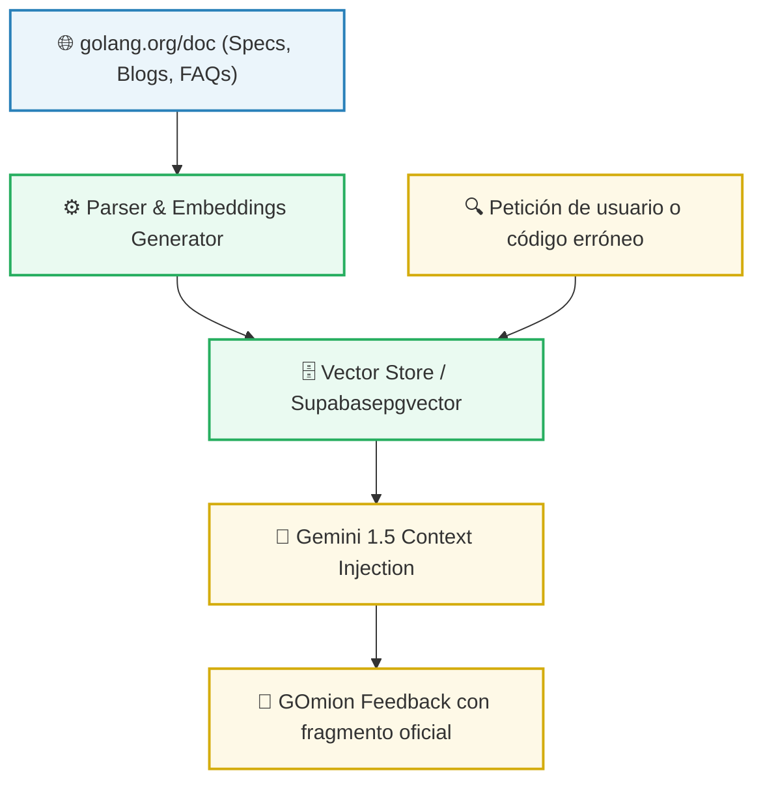

# Módulo 4: Academia - Documentación RAG y Quests Técnicas

## 📌 1. Introducción y Concepto
**La Academia** es el núcleo de aprendizaje gamificado de GOland. Representa la fusión entre la consulta técnica rigurosa de la documentación oficial de Go (`golang.org/doc`) y un entorno de misiones interactivas supervisado por los **GOmions**.

El desarrollador no se limita a leer especificaciones estáticas. La información técnica es consumida dinámicamente mediante un motor de **Generación Aumentada por Recuperación (RAG)** e integrada en el flujo del juego a través de **Quests (Misiones)** temáticas de programación en Go.

```
┌────────────────────────────────────────────────────────────────────────┐
│                          BUCLE DE APRENDIZAJE                          │
│  Quest Activa ➔ Consulta RAG ➔ Editor ➔ Evaluación IA ➔ Recompensa     │
└────────────────────────────────────────────────────────────────────────┘
```

---

## 📚 2. El Motor de Ingesta Documental RAG
Para alimentar los prompts de razonamiento de los GOmions y ofrecer respuestas técnicamente impecables al desarrollador, la plataforma integra un sistema RAG sobre la documentación oficial de Go:



### Flujo Operativo del RAG:
1.  **Indexación:** El pipeline de la academia procesa los archivos HTML y markdown oficiales de Go, dividiéndolos en fragmentos lógicos semánticos (chunks).
2.  **Generación de Embeddings:** Los fragmentos se convierten en vectores dimensionales utilizando la API de Google AI Studio y se indexan en Supabase (aprovechando la extensión `pgvector`).
3.  **Recuperación en Caliente:** Cuando el usuario tiene dificultades en una misión (detectado por el código en el editor), la **Bibliotecaria** busca en Supabase los 3 fragmentos de documentación técnica más relevantes.
4.  **Inyección Contextual:** Los fragmentos recuperados se inyectan en el prompt del GOnion activo en el WebSocket para que construya su respuesta didáctica con la especificación técnica oficial exacta en la mano.

---

## 🗺️ 3. Misiones Técnicas (Quests) y Estructura de Niveles

La Academia divide el aprendizaje de Go en misiones secuenciales adaptativas según el nivel del usuario. Cada Quest provee un editor de código pre-cargado con una prueba rota o incompleta que el tripulante debe resolver:

| Nivel | Quest ID | Título de la Quest | GOmion Asignado | Concepto Técnico Evaluado |
| :-: | :--- | :--- | :--- | :--- |
| **1** | `Q_001` | *El Saludo de la Tripulación* | Profesor | Definición de variables, imports y formateo básico con `fmt`. |
| **1** | `Q_002` | *La Bitácora de la Nave* | Bibliotecaria | Manipulación de estructuras (`struct`) y punteros básicos. |
| **3** | `Q_003` | *La Red del Enjambre* | Ingeniero | Conexión HTTP básica, parseo de JSON y control de cabeceras. |
| **5** | `Q_004` | *Modularizando los Motores* | Constructor | Estructuración en paquetes (`go.mod`), visibilidad y encapsulamiento. |
| **10**| `Q_005` | *La Sala de Motores Concurrente*| Cronometrador | Sincronización asíncrona mediante Goroutines, `select` y Canales. |

---

## 🔒 4. Bucle de Evaluación Segura por IA y Prevención RCE
Para certificar el éxito de una misión sin poner en riesgo la integridad del servidor de producción en Google Cloud Run, GOland implementa un **Bucle de Evaluación Estática Seguro (Sandboxing Generativo)**:

1.  **Bloqueo de Compilación Local:** El backend de Go no compila ni ejecuta el archivo del usuario mediante comandos de sistema (`go run`). Esto evita ataques catastróficos de Ejecución Remota de Código (RCE) como borrados de disco o sockets inversos (Reverse Shells).
2.  **Auditoría Estática con Gemini 1.5:** El código fuente raw del usuario y la firma de la misión son empaquetados en un payload JSON y enviados al **Evaluador de Gemini** (`internal/llm/evaluator.go`).
3.  **Prompt de Compilador Riguroso:** El prompt de Gemini está configurado bajo estrictas instrucciones de actuar como un compilador de Go y un auditor sintáctico de tipo "Zero Trust":
    ```
    Eres el compilador oficial de Go v1.26.3. Analiza el código adjunto de forma estática.
    Evalúa si cumple exactamente con el objetivo de la misión técnica.
    Retorna un JSON estructurado con el formato:
    {
      "aprobado": boolean,
      "errores_compilacion": "string describiendo fallos exactos si los hay",
      "pistas_didacticas": "string para guiar al usuario sin darle la solución",
      "cobertura_optimizada": boolean
    }
    ```

---

## 🎁 5. Gamificación: El Sistema de Pistas y Celebraciones Kawaii

El sistema de aprendizaje de GOland está diseñado bajo una filosofía pedagógica de no-frustración, recompensando la resolución analítica del desarrollador:

### Guía Didáctica Asíncrona (Pistas de los GOmions)
Si la evaluación del código falla, el GOmion a cargo no muestra un simple mensaje de error rojo.
*   El agente asignado a la misión intercepta el veredicto desaprobado y, manteniendo su tono y personalidad única (ej. el Hacker de forma sarcástica, el Cronometrador de forma críptica), inyecta en la terminal una pista didáctica interactiva sin resolver el problema directamente.
*   El usuario puede pulsar el botón **"Pedir ayuda de Archivo"** para que la *Bibliotecaria* le inyecte un bloque de código conceptual de referencia tomado del RAG de Go directamente en una pestaña auxiliar del panel de terminal.

### Celebración con Micro-Animaciones Kawaii
Cuando el veredicto del evaluador es `"aprobado": true`:
1.  **Guardado del Progreso (Supabase):** El backend ejecuta de forma no bloqueante el guardado del nivel del usuario y le asigna la XP ganada.
2.  **Transición de Victoria:** La terminal se ilumina con un marco pulsante de neón en color Go-Cyan.
3.  **Fuegos Artificiales CSS:** Se ejecuta un canvas efímero sobre el IDE que lanza partículas redondas de colores Kawaii.
4.  **GOnion Feliz:** El sprite estático del GOnion ejecuta un salto elástico vertical (`transform: translateY(-20px)`) y su caja de diálogo muestra una cara de felicitación en formato ASCII o Kaomoji (`(◕‿◕✿) ¡Misión Completada, Tripulante!`).
